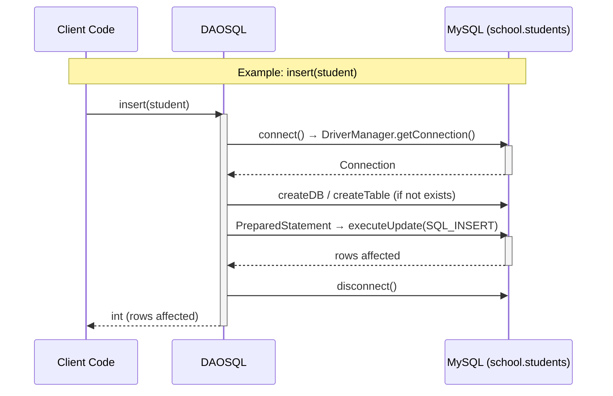

# MP0485_RA9_JDBC_Template_Template - Student Management System

## Project Overview

This project implements a Student Management System using Java with JDBC (Java Database Connectivity). It uses a Data Access Object (DAO) pattern to encapsulate all database operations against a MySQL database.

## Architecture

The application is structured in the following layers:
- **DAO Layer** (`dao/`): Interface definition (`IDAO`) and MySQL implementation (`DAOSQL`)
- **Exception Layer** (`exception/`): Custom exception hierarchy for error handling
- **Model**: `Student` entity with fields `id`, `name`, and `age`

## Sequence Diagram

Below is the sequence diagram illustrating the flow of a typical DAO operation:



## Project Structure

```
src/main/java/
├── dao/
│   ├── IDAO.java                    # DAO interface (insert, read, update, deleteALL)
│   └── DAOSQL.java                  # MySQL JDBC implementation
├── exception/
│   ├── DAO_Excep.java               # Base DAO exception
│   ├── Read_SQL_DAO_Excep.java      # Read operation exceptions
│   ├── Write_SQL_DAO_Excep.java     # Write operation exceptions
│   └── Student_Excep.java           # Student validation exceptions
```

## DAO Interface (`IDAO`)

| Method | Signature | Description |
|--------|-----------|-------------|
| `insert` | `int insert(Student student) throws DAO_Excep` | Inserts a new student row |
| `read` | `List<Student> read(Student student) throws DAO_Excep` | Selects students matching the given name |
| `update` | `int update(Student student) throws DAO_Excep` | Updates the age for a student by name |
| `deleteALL` | `int deleteALL() throws DAO_Excep` | Deletes all rows from the table |

## Database Configuration (`DAOSQL`)

| Property | Value |
|----------|-------|
| JDBC URL | `jdbc:mysql://localhost:3306` |
| Database | `school` |
| Table | `students` |
| User | `root` |
| Password | *(empty)* |

### Table Schema

```sql
CREATE TABLE IF NOT EXISTS school.students (
    id   BIGINT PRIMARY KEY AUTO_INCREMENT,
    name VARCHAR(50),
    age  INT
);
```

> `DAOSQL.connect()` automatically creates the database and table if they do not exist.

## Data Flow Examples

### Reading Student Data
1. Client calls `dao.read(student)` with a `Student` whose `name` is set
2. `DAOSQL` opens a connection and auto-creates DB/table if needed
3. Executes `SELECT * FROM school.students WHERE (name = '...')`
4. Maps each `ResultSet` row to a `Student(id, name, age)` object
5. Returns `List<Student>` to the caller; connection is closed in `finally`

### Writing Student Data
1. Client calls `dao.insert(student)` / `dao.update(student)`
2. `DAOSQL` opens a connection and uses a `PreparedStatement`
3. Executes `INSERT INTO school.students (name, age) VALUES (?, ?)` or `UPDATE … SET age = ? WHERE (name = ?)`
4. Returns number of affected rows; connection is closed in `finally`

## Technologies

- **Language**: Java 16
- **Build Tool**: Maven
- **Database**: MySQL 8 (via JDBC)
- **JDBC Driver**: `mysql-connector-java 8.0.33`
- **Design Pattern**: DAO

## Exception Handling

The application implements a custom exception hierarchy:

- `DAO_Excep` — base checked exception for all DAO errors
  - `Read_SQL_DAO_Excep` — thrown on SELECT failures or result-set close errors
  - `Write_SQL_DAO_Excep` — thrown on INSERT / UPDATE / DELETE failures
- `Student_Excep` — for student-level validation errors

## Getting Started

1. Ensure a MySQL server is running on `localhost:3306` with user `root` and an empty password
2. No manual schema setup required — `DAOSQL.connect()` creates the `school` database and `students` table automatically
3. Build the project: `mvn clean compile`
4. Add your client code that instantiates `DAOSQL` and calls its methods through the `IDAO` interface
